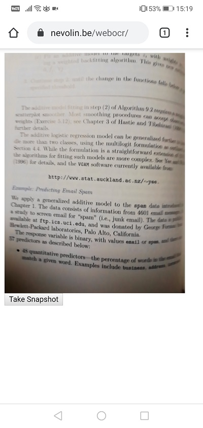
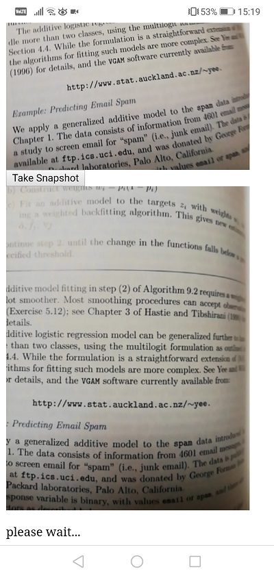
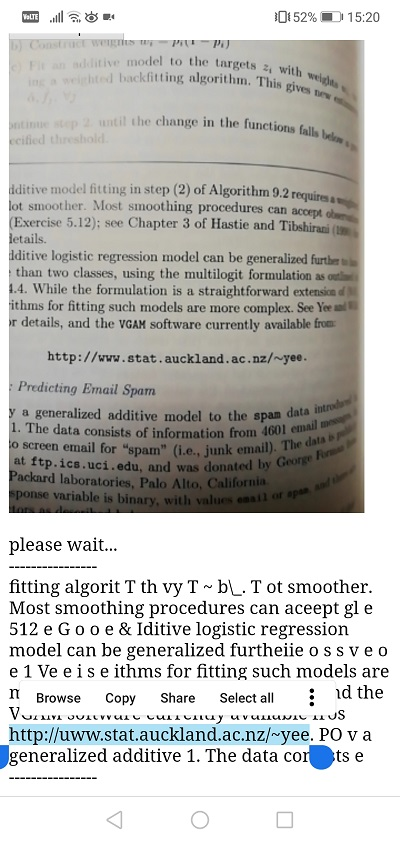
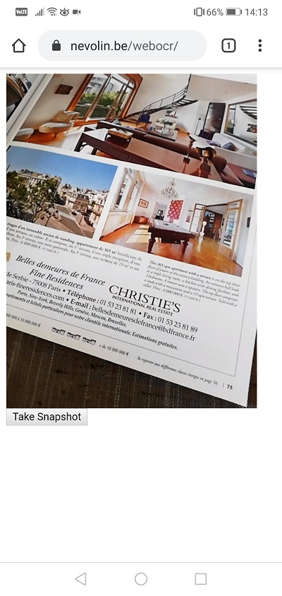
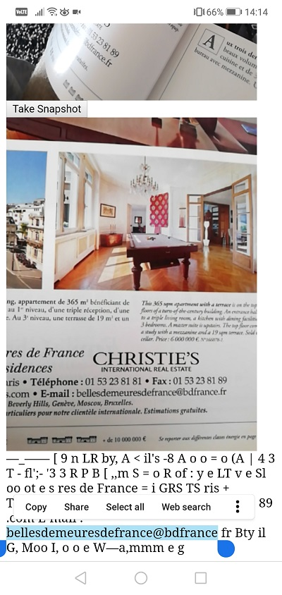

# WebOCR
Minimalistic OCR from camera devices. Recognize and copy text from photos made on your mobile device or any other device with camera access. This solution uses TesseractJS as OCR system.

## demo

1. visit https://nevolin.be/webocr/
2. allow camera access
3. aim at some text and click the button
4. wait a few seconds for the image to be processed
5. the detected text will be shown below

## installation

You need NodeJS v12+.

Clone or download this repository, then execute `npm install` to download dependencies.

Use `node server.js` to launch the service script.

To keep it running 24/7 use a library like PM2 and execute: `pm2 start ecosystem.config.js` .

## devs

There are two ways to carry out OCR: client-side and server-side (default).
To enable client-side OCR (which will execute in the users's browser) is much slower but could be tweaked using more workers. For these configurations you should consult TesseractJS's API docs. To enable client-side OCR use the function `localProcessImg()` instead of `serverProcessImg()` inside `/public/main.js`.

## screenshots demo 1

 
 
 

## screenshots demo 2

 
 

## support
For enquiries or issues get in touch with me:

Name: Ilya Nevolin

Email: ilja.nevolin@gmail.com
